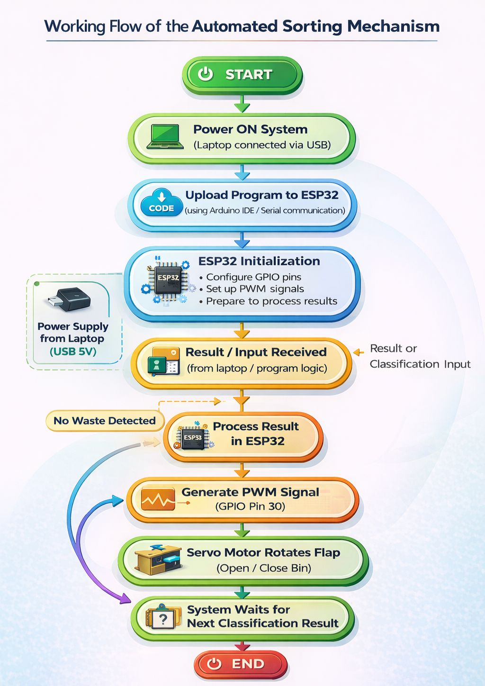
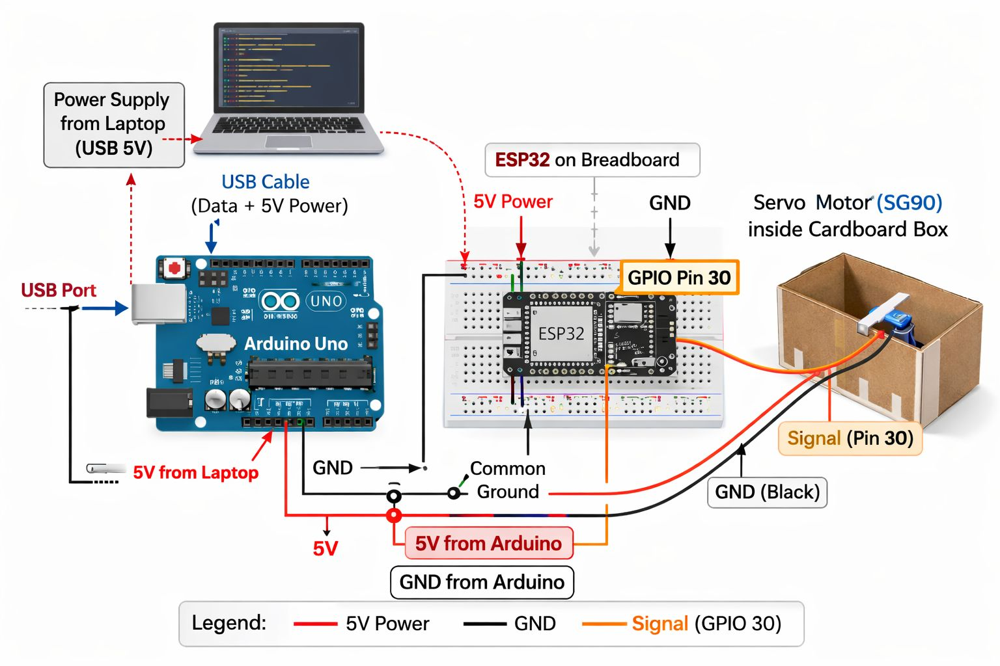
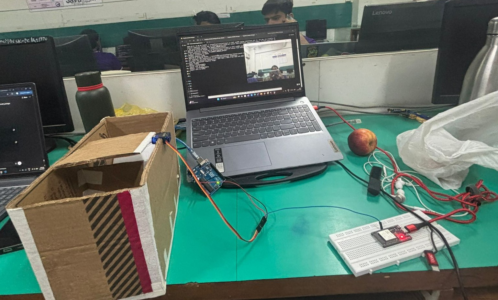
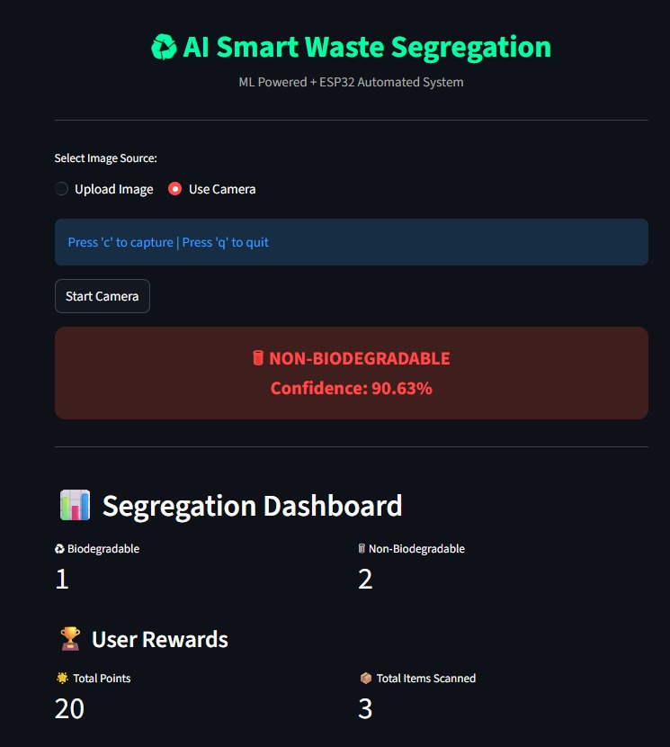

# ♻ AI Smart Waste Segregation & Collection System  
### Global Innovation AI 2026 | Team SNAPSORT  

> “AI-driven automation for sustainable waste management.”

---

## 🌍 Problem Statement

Build a digital solution that improves waste segregation and collection at the source.

Traditional waste management systems rely on manual segregation, leading to:
- Human error
- Unsafe handling
- Inefficient collection
- No real-time monitoring

Our system provides an AI-powered automated solution to address these challenges.

---

## 🚀 Solution Overview

This project integrates **Machine Learning + IoT + Embedded Systems** to:

- 📷 Capture waste image
- 🤖 Classify waste using ML model
- 🔌 Communicate with ESP32
- ⚙ Automatically rotate servo flap
- 📊 Monitor bin fill level (10 flaps capacity per side)
- 📧 Notify central manager when bin is full
- 🏆 Reward users with points

---

## 🧠 System Architecture

### 1️⃣ Image Capture & AI Processing
- Laptop camera captures waste image
- TensorFlow/Keras model predicts:
  - BIO (Biodegradable)
  - NONBIO (Non-Biodegradable)

### 2️⃣ Serial Communication
- Python sends `'B'` or `'N'` via serial
- ESP32 receives command

### 3️⃣ Servo-Based Automated Sorting
- Servo motor rotates:
  - 45° → Biodegradable
  - 135° → Non-Biodegradable
- Returns to neutral position

### 4️⃣ Smart Collection Monitoring
- Independent bin tracking (10 items per side)
- Fill percentage displayed
- Email alert when bin is full

---

## 🔄 System Workflow

1. User places waste
2. Camera scans object
3. ML model predicts class
4. Result sent to ESP32
5. Servo rotates flap
6. Bin fill level updated
7. Notification sent if full

---

## 🔌 Circuit Diagram

### Hardware Used

- ESP32 WROOM Module
- Arduino UNO (5V regulation)
- SG90 Servo Motor
- Breadboard
- Jumper wires
- Laptop

---

## 🧱 Hardware Prototype

Low-cost cardboard-based smart dustbin prototype.

---

## 📊 Frontend Dashboard

Features:
- Real-time waste classification
- Confidence score display
- Segregation count tracking
- Reward points system
- Independent bin fill status
- Collection alert notification

---

## 📦 Key Features

✅ AI-based waste classification  
✅ Dual-bin independent capacity (10 flaps each)  
✅ Automated servo motor segregation  
✅ Smart fill-level prediction  
✅ Email-based centralized notification  
✅ Digital CSV logging  
✅ Reward gamification system  
✅ Low-cost scalable design  

---

## ⚙ Tech Stack

| Component | Technology |
|------------|------------|
| AI Model | TensorFlow / Keras |
| Frontend | Streamlit |
| Computer Vision | OpenCV |
| Microcontroller | ESP32 |
| Actuator | SG90 Servo |
| Programming | Python + C++ (Arduino) |
| Communication | Serial (USB) |

---

## 📊 Feasibility & Viability

### Technical Feasibility
- Real-time waste classification achieved
- Smooth hardware operation

### Economic Feasibility
- Low-cost components
- Reduced manual labor cost

### Operational Viability
- Easy installation
- Low maintenance
- Suitable for smart cities

### Environmental Impact
- Encourages proper recycling
- Reduces landfill waste
- Contactless waste handling

---

## 📈 Advantages Over Traditional System

| Parameter | AI-Based System | Traditional |
|------------|----------------|-------------|
| Cost | Low | High |
| Accuracy | High | Moderate |
| Safety | Contactless | Manual |
| Scalability | Easily Scalable | Limited |

---

## 🔮 Future Scope

- ☁ IoT Cloud Monitoring
- 📱 Mobile App Integration
- ☀ Solar-powered system
- ♻ Multi-class waste detection
- 🚛 Route optimization for collection trucks

---

## 🎥 Demo Video

(You will add your video link here)

---

## Model

Due to file size limitations, the trained model is not included in the repository.

Download here:
https://drive.google.com/file/d/1iK7jvSfYGHCvXhUvm1KGsVtuS3Wo4Z-w/view?usp=sharing

## 👨‍💻 Team SNAPSORT
 
Global Innovation AI – Environment Theme

---

## 🏁 Conclusion

This project demonstrates how Artificial Intelligence, IoT, and Embedded Systems can be integrated to build a scalable, efficient, and smart waste management solution that improves both segregation and collection at the source.
